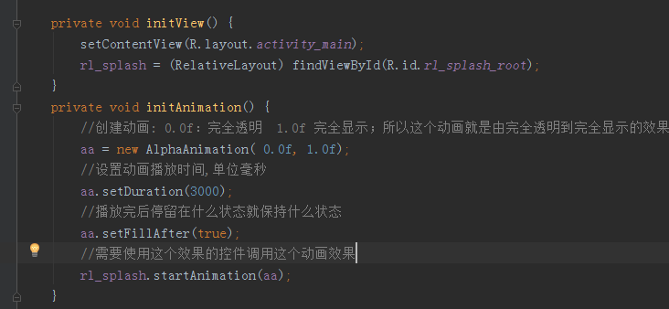
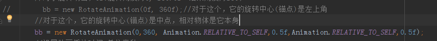
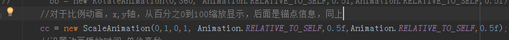
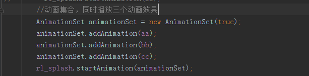

##Animation
	在android中有三种动画
####Property Animation 属性动画(补间动画做得到的，它都可以做，做不到的，它都可以做)
	原理:通过改变自身的属性来显示动画的
> Introduced in Android 3.0 (API level 11), the property animation system lets you animate properties of any object, including ones that are not rendered to the screen. The system is extensible and lets you animate properties of custom types as well.
####View Animation  视图动画(补间动画)
	原理:通过父容器来绘制自己动画时的样子
> View Animation is the older system and can only be used for Views. It is relatively easy to setup and offers enough capabilities to meet many application's needs.
> Drawable Animation	
####Drawable animation 可绘制动画(帧动画)
>  involves displaying Drawable resources one after another, like a roll of film. This method of animation is useful if you want to animate things that are easier to represent with Drawable resources, such as a progression of bitmaps.
_________________________________________

####定义动画---ViewAnimation,Tween
######AlphaAnimation 渐变动画 从无到有

######RotateAnimation 旋转动画
	对于旋转动画，就是它的构造方法不一样，其他雷同

######ScaleAnimation 比例动画 从小到大

######TranslateAnimation 位移动画
######AnimationSet 动画集 (包含多个动画)
