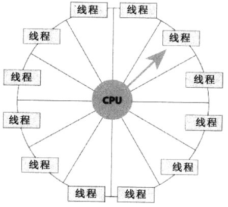
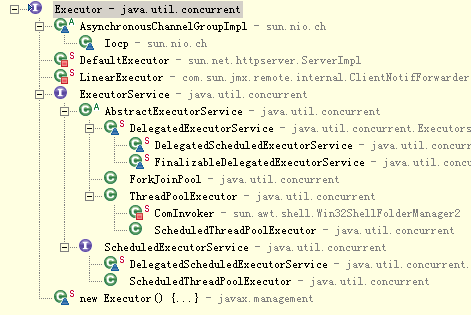
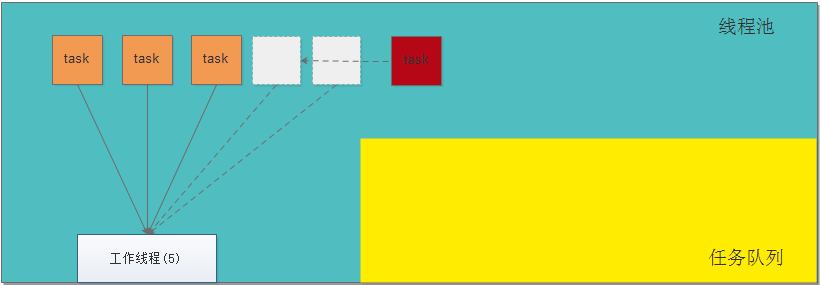
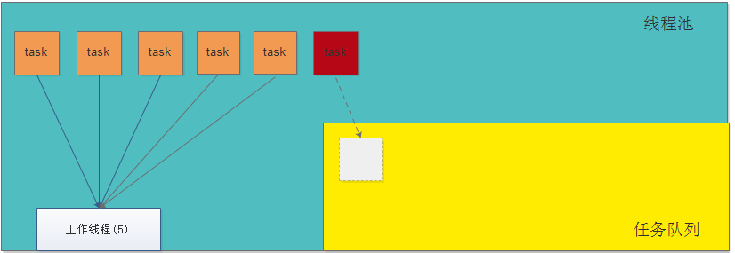
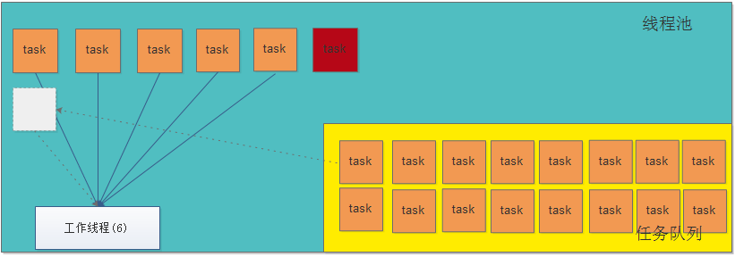
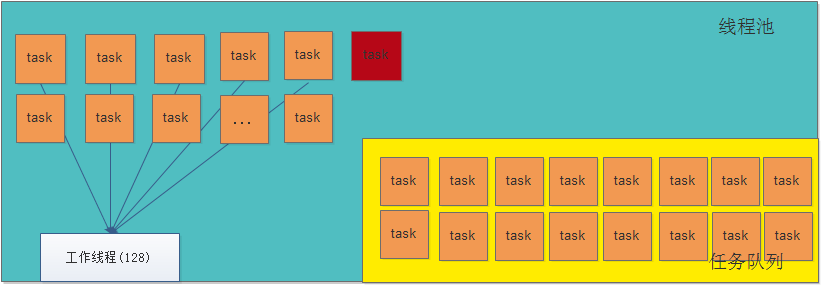

##线程的运行机制
>* 开启线程过多,会消耗cpu
>* 单核cpu,同一时刻只能处理一个线程,多核cpu同一时刻可以处理多个线程
>* 操作系统为每个运行线程安排一定的CPU时间----`时间片`,系统通过一种循环的方式为线程提供时间片,线程在自己的时间内运行,因为时间相当短,多个线程频繁地发生切换,因此给用户的感觉就是好像多个线程同时运行一样,但是如果计算机有多个CPU,线程就能真正意义上的同时运行了.
>

##线程池的作用
>* 线程池是预先创建线程的一种技术。线程池在还没有任务到来之前，创建一定数量的线程，放入空闲队列中，然后对这些资源进行复用。`减少频繁的创建和销毁对象。`
>* 频繁创建和销毁线程耗资源,耗时间
>* 因为有的线程执行时间比创建和销毁一个线程的时间还长`

## 线程池涉及的类
* Executor:Java里面线程池的顶级接口
* ExecutorService:真正的线程池接口
* ScheduledExecutorService:能和Timer/TimerTask类似，解决那些需要任务重复执行的问题
* ThreadPoolExecutor(重点):ExecutorService的默认实现。
* ScheduledThreadPoolExecutor:继承ThreadPoolExecutor的ScheduledExecutorService接口实现，周期性任务调度的类实现。

## Executors
> Executors:jdk1.5之后的一个新类,`提供了一些静态工厂，生成一些常用的线程池`,ThreadPoolExecutor是Executors类的底层实现

1.newSingleThreadExecutor
>创建一个单线程的线程池。这个线程池只有一个线程在工作，也就是相当于单线程串行执行>所有任务。如果这个唯一的线程因为异常结束，那么会有一个新的线程来替代它。此线程池>保证所有任务的执行顺序按照任务的提交顺序执行。

2.newFixedThreadPool
>创建固定大小的线程池。每次提交一个任务就创建一个线程，直到线程达到线程池的最大大小。线程池的大小一旦达到最大值就会保持不变，如果某个线程因为执行异常而结束，那么线程池会补充一个新线程。

3.newCachedThreadPool
>创建一个可缓存的线程池。如果线程池的大小超过了处理任务所需要的线程，
>那么就会回收部分空闲（60秒不执行任务）的线程，当任务数增加时，此线程池又可以智能的添加新线程来处理任务。此线程池不会对线程池大小做限制，线程池大小完全依赖于操作系统（或者说JVM）能够创建的最大线程大小。

4.newScheduledThreadPool
>创建一个大小无限的线程池。此线程池支持定时以及周期性执行任务的需求。

## ThreadPoolExecutor介绍
	//构造方法
	public ThreadPoolExecutor(int corePoolSize,//核心池的大小
	                              int maximumPoolSize,//线程池最大线程数
	                              long keepAliveTime,//保持时间
	                              TimeUnit unit,//时间单位
	                              BlockingQueue<Runnable> workQueue,//任务队列
	                              ThreadFactory threadFactory,//线程工厂
	                              RejectedExecutionHandler handler) //异常的捕捉器
###构造相关参数解释
* corePoolSize：`核心池的大小`，这个参数跟后面讲述的线程池的实现原理有非常大的关系。在创建了线程池后，默认情况下，线程池中并没有任何线程，而是等待有任务到来才创建线程去执行任务，除非调用了prestartAllCoreThreads()或者prestartCoreThread()方法，从这2个方法的名字就可以看出，是预创建线程的意思，即在没有任务到来之前就创建corePoolSize个线程或者一个线程。默认情况下，在创建了线程池后，线程池中的线程数为0，当有任务来之后，就会创建一个线程去执行任务，当线程池中的线程数目达到corePoolSize后，就会把到达的任务放到缓存队列当中；
* maximumPoolSize：`线程池最大线程数`，这个参数也是一个非常重要的参数，它表示在线程池中最多能创建多少个线程；
* keepAliveTime：`表示线程没有任务执行时最多保持多久时间会终止`。默认情况下，只有当线程池中的线程数大于corePoolSize时，keepAliveTime才会起作用，直到线程池中的线程数不大于corePoolSize，即当线程池中的线程数大于corePoolSize时，如果一个线程空闲的时间达到keepAliveTime，则会终止，直到线程池中的线程数不超过corePoolSize。但是如果调用了allowCoreThreadTimeOut(boolean)方法，在线程池中的线程数不大于corePoolSize时，keepAliveTime参数也会起作用，直到线程池中的线程数为0；
* unit：参数keepAliveTime的`时间单位`，有7种取值

		TimeUnit.DAYS;               //天
		TimeUnit.HOURS;             //小时
		TimeUnit.MINUTES;           //分钟
		TimeUnit.SECONDS;           //秒
		TimeUnit.MILLISECONDS;      //毫秒
		TimeUnit.MICROSECONDS;      //微妙
		TimeUnit.NANOSECONDS;       //纳秒
* workQueue ： `任务队列`,是一个阻塞队列，用来存储等待执行的任务，这个参数的选择也很重要，会对线程池的运行过程产生重大影响,参考BlockingQueue

		ArrayBlockingQueue;
		LinkedBlockingQueue;
		SynchronousQueue;
* threadFactory : `线程工厂`，如何去创建线程的
* handler ： 任务队列添加`异常的捕捉器`，参考 RejectedExecutionHandler
		
		ThreadPoolExecutor.AbortPolicy:丢弃任务并抛出RejectedExecutionException异常。 
		ThreadPoolExecutor.DiscardPolicy：也是丢弃任务，但是不抛出异常。 
		ThreadPoolExecutor.DiscardOldestPolicy：丢弃队列最前面的任务，然后重新尝试执行任务（重复此过程）
		ThreadPoolExecutor.CallerRunsPolicy：由调用线程处理该任务 
###基础API的介绍
* isShutdown() ： 判断线程池是否关闭
* isTerminated() : 判断线程池中任务是否执行完成
* shutdown() : 调用后不再接收新任务，如果里面有任务，就执行完
* shutdownNow() : 调用后不再接受新任务，如果有等待任务，移出队列；有正在执行的，尝试停止之
* submit() : 提交执行任务
* execute() : 执行任务

###任务提交给线程池之后的处理策略
1. 如果当前线程池中的线程数目小于corePoolSize，则每来一个任务，就会创建执行这个任务；
2. 如果当前线程池中的线程数目>=corePoolSize，则每来一个任务，会尝试将其添加到任务缓存队列当中
	1. 若添加成功，则该任务会等待空闲线程将其取出去执行；
	2. 若添加失败（一般来说是任务缓存队列已满），则会尝试创建新的线程去执行这个任务；
3. 如果当前线程池中的线程数目达到maximumPoolSize，则会采取任务拒绝策略进行处理；
4. 如果线程池中的线程数量大于 corePoolSize时，如果某线程空闲时间超过keepAliveTime，线程将被终止，直至线程池中的线程数目不大于corePoolSize；如果允许为核心池中的线程设置存活时间，那么核心池中的线程空闲时间超过keepAliveTime，线程也会被终止。

###任务提交给线程池之后的处理策略_比喻
>假如有一个工厂，工厂里面有10(`corePoolSize`)个工人，每个工人同时只能做一件任务。

>因此只要当10个工人中有工人是空闲的，`来了任务就分配`给空闲的工人做；

>当10个工人都有任务在做时，如果还来了任务，就把任务进行排队等待(`任务队列`)；

>如果说新任务数目增长的速度远远大于工人做任务的速度，那么此时工厂主管可能会想补救措施，比如重新招4个临时工人(`创建新线程`)进来；然后就将任务也分配给这4个临时工人做；

>如果说着14个工人做任务的速度还是不够，此时工厂主管可能就要考虑不再接收新的任务或者抛弃前面的一些任务了(`拒绝执行`)。

>当这14个工人当中有人空闲时，而且空闲超过一定时间(`空闲时间`),新任务增长的速度又比较缓慢，工厂主管可能就考虑辞掉4个临时工了，只保持原来的10个工人，毕竟请额外的工人是要花钱的

## 阻塞队列的介绍（BlockingQueue）
阻塞队列，如果BlockingQueue是空的，从BlockingQueue取东西的操作将会被阻断进入等待状态，直到BlockingQueue进了东西才会被唤醒，同样，如果BlockingQueue是满的，任何试图往里存东西的操作也会被阻断进入等待状态，直到BlockingQueue里有空间时才会被唤醒继续操作。

1. 基础API介绍
	* __往队列中加元素的方法__
		* add(E) : 非阻塞方法, 把元素加到BlockingQueue里，如果BlockingQueue可以容纳，则返回true，否则抛出异常。
		* offer(E) : 非阻塞, 表示如果可能的话，将元素加到BlockingQueue里，即如果BlockingQueue可以容纳，则返回true，否则返回false。
		* __put(E)__：阻塞方法， 把元素加到BlockingQueue里，如果BlockingQueue没有空间，则调用此方法的线程被阻断直到BlockingQueue里有空间再继续。
	
	* __从队列中取元素的方法__
		* __poll(time)__： 阻塞方法，取走BlockingQueue里排在首位的元素，若不能立即取出，则可以等time参数规定的时间，取不到时返回null。
		* __take()__：取走BlockingQueue里排在首位的对象，若BlockingQueue为空，阻断进入等待状态直到BlockingQueue有新的对象被加入为止。

2. 子类介绍
	* `ArrayBlockingQueue(有界队列)`： FIFO 队列，规定大小的BlockingQueue，其构造函数必须带一个int参数来指明其大小
	
	* `LinkedBlockingQueue(无界队列)`：FIFO 队列，大小不定的BlockingQueue，若其构造函数带一个规定大小的参数，生成的BlockingQueue有大小限制，若不带大小参数，所生成的BlockingQueue的大小由Integer.MAX_VALUE来决定。

	* `PriorityBlockingQueue`：优先级队列， 类似于LinkedBlockingQueue，但队列中元素非 FIFO, 依据对象的自然排序顺序或者是构造函数所带的Comparator决定的顺序

	* `SynchronousQueue(直接提交策略)`: 交替队列，队列中操作时必须是先放进去，接着取出来，交替着去处理元素的添加和移除

## RejectedExecutionHandler介绍
###实现的子类介绍

* ThreadPoolExecutor.AbortPolicy 
	> 当添加任务出错时的策略捕获器，如果出现错误，则直接抛出异常

* ThreadPoolExecutor.CallerRunsPolicy
	> 当添加任务出错时的策略捕获器，如果出现错误，直接执行加入的任务

* ThreadPoolExecutor.DiscardOldestPolicy
	> 当添加任务出错时的策略捕获器,如果出现错误,移除第一个任务,执行加入的任务

* ThreadPoolExecutor.DiscardPolicy
	> 当添加任务出错时的策略捕获器，如果出现错误，不做处理

