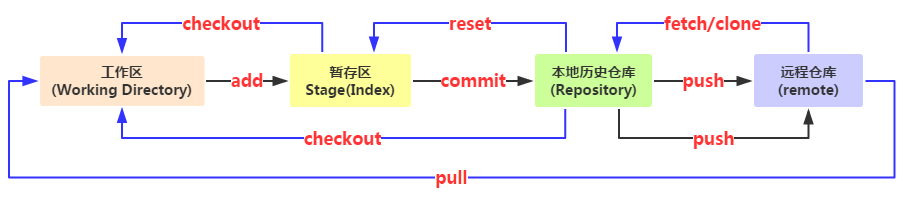

###命令
####初始化仓库
	- git init

####添加文件
	- git add

####查看状态
	- git status

####查看修改了什么
	- git diff	

####日志查看
	- git log
####事务回滚
	- git reset --hard HEAD^
	- 注意，"--hard"的意思是
	- "HEAD^"是回滚到上一次commit的状态
	- "HEAD^^"是回滚到上上一次commit的状态
	- "HEAD~100"是回滚到上100次commit的状态

####查看每一次commit记录的命令
	- git reflog

####撤销文件的修改，回到最后一次commit或者add的状态
	- git checkout -- file.xxx